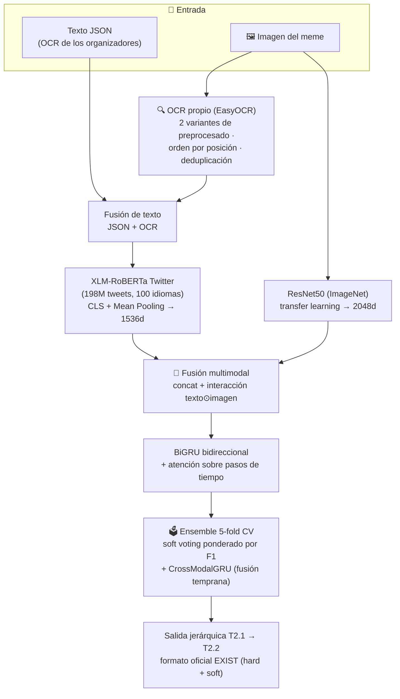

# 🎯 EXIST 2025 — Detección multimodal de sexismo en memes


Sistema **multimodal (texto + imagen)** que detecta sexismo en memes de redes sociales, construido sobre la *shared task* internacional [EXIST 2025](https://nlp.uned.es/exist2025/) (CLEF 2025, Madrid — 244 equipos registrados de 38 países):

- **Subtarea 2.1** — ¿Es sexista el meme? → `YES / NO`
- **Subtarea 2.2** — ¿Con qué intención? → `DIRECT` (sexista en sí mismo) / `JUDGEMENTAL` (condena el sexismo)

> **Contexto honesto:** este trabajo se realizó como proyecto académico **después del cierre de la campaña oficial**, partiendo del ejercicio base publicado y siguiendo las *guidelines* oficiales (incluidas en el repo). Las predicciones se generan en el formato oficial de evaluación (PyEvALL) y las métricas se contrastan con el leaderboard publicado en el *overview* oficial — comparación **indicativa** (holdout interno vs. test oficial), detallada en la sección de Evaluación.

## 🧠 Arquitectura



### Decisiones técnicas y por qué

| Técnica | Por qué |
|---------|---------|
| **OCR propio** (EasyOCR, doble variante de contraste) | El texto oficial del dataset pierde tipografías decorativas y texto lateral. El OCR propio recupera texto omitido, lo ordena por posición (bbox) y se fusiona con el oficial solo si aporta ≥6 palabras nuevas |
| **Backbone de Twitter** (`cardiffnlp/twitter-xlm-roberta-base-sentiment`) | Embeddings entrenados en 198M de tweets: mismo dominio (redes sociales, ES+EN) y mismo coste que el XLM-R genérico |
| **CLS + Mean Pooling concatenados** (1536d) | El CLS captura el significado global; el mean pooling, las palabras clave distribuidas. El clasificador decide cuál pesa más en cada caso |
| **Soft labels de los 6 anotadores** | Los memes con empate 3-3 no se descartan: se entrena con *soft cross-entropy* sobre la distribución real de votos, penalizando menos los errores donde ni los humanos se pusieron de acuerdo |
| **Ensemble 5-fold + voto ponderado por F1** | Diversidad real por subconjunto de datos (no solo por semilla) y más peso a los folds que mejor validan |
| **Fusión con interacción** (texto ⊙ imagen) | El producto elemento a elemento captura correlaciones directas texto-imagen que la concatenación no ve — clave en memes donde el sexismo nace del contraste entre ambos |
| **Focal Loss (γ=4) + oversampling + calibración de umbral** (T2.2) | La clase `JUDGEMENTAL` es minoritaria y ambigua: la Focal Loss concentra el aprendizaje en los ejemplos difíciles y el umbral se calibra en validación |
| **Salida jerárquica** | P(DIRECT) y P(JUDGEMENTAL) se condicionan a P(YES) de la subtarea 2.1, garantizando distribuciones coherentes que suman 1 |

## ⚡ Ejecución

```bash
pip install -r requirements.txt
python Proyecto.py
```

**Dataset:** el EXIST 2025 Memes Dataset se solicita a los [organizadores](https://nlp.uned.es/exist2025/) (no se redistribuye). Colocar las carpetas `EXIST 2025 Memes Dataset.../` y `Resultados Training.../` junto a `Proyecto.py`.

Notas de ejecución:

- Primera ejecución: descarga los modelos (~1 GB) y extrae características + OCR (15-90 min en CPU). Todo queda **cacheado** en `cache/` — las siguientes ejecuciones tardan <1 min.
- `LOAD_PRETRAINED = True` carga modelos ya entrenados desde `predictions/`; ponlo a `False` para reentrenar desde cero.
- Las predicciones se guardan en `predictions/` en el formato oficial (hard + soft JSON).

## 📊 Evaluación

**Protocolo sin fuga de datos:** antes de cualquier entrenamiento se aparta un **holdout estratificado del 15%** que ningún modelo ve jamás — el k-fold, el early-stopping y los pesos del ensemble se calculan únicamente con el 85% restante, y toda métrica final sale del holdout. En la subtarea 2.2 el split es 70/15/15: el umbral de decisión se calibra en *val* y se reporta sobre el *holdout*. Los splits se persisten en disco para reproducibilidad.

| Subtarea | F1 macro (holdout) | Por clase |
|----------|--------------------|-----------|
| **2.1** ¿Es sexista? | **0.61** | YES 0.74 · NO 0.49 (607 memes) |
| **2.2** Intención | **0.54** | DIRECT 0.76 · JUDGEMENTAL 0.32 (273 memes) |

La clase `JUDGEMENTAL` (memes que condenan el sexismo) es con diferencia la más difícil: minoritaria y ambigua incluso para los anotadores humanos — la misma conclusión que reportan los equipos de la campaña oficial.

### Contraste con el leaderboard oficial (indicativo)

Los gold labels del test oficial no son públicos, así que nuestras métricas salen del holdout interno y la comparación con el [*Extended Overview* oficial de EXIST 2025](https://www.damianospina.com/publication/plaza-2025-extended/plaza-2025-extended.pdf) (Tablas 13 y 15) es **orientativa, no un ranking**:

- **Subtarea 2.1** — la tabla oficial (hard) reporta **F1 de la clase YES**: nuestro **0,74** supera el baseline mayoritario oficial (0,68) en **+5,8 puntos** y cae en el rango medio-alto de los 18 sistemas presentados (que van de 0,48 a 0,78; solo 16 de 18 superaron el baseline).
- **Subtarea 2.2** — la tabla oficial (hard) reporta **F1 macro**: nuestro **0,54** se compara con un leaderboard que va de 0,10 a 0,56 (baseline mayoritario: 0,18) — es decir, el rango de los sistemas de cabeza de una tarea donde la mayoría de equipos quedó por debajo de 0,40.

## 🔄 El círculo cerrado: fine-tuning VLM con el Motor de LoRAs

Este pipeline dio origen al **Motor de LoRAs** (fábrica local de fine-tuning y despliegue de LLMs; repo próximamente público) — y en julio de 2026 el Motor volvió al problema original como su primer caso de estudio medible. Su `VLMTrainer` afinó **Qwen2-VL-2B-Instruct** (LoRA r=16, bf16, 3 épocas, **52 min en una RTX 4080 con 6 GB de VRAM**) sobre el mismo *fold-0 train*, calibró el umbral en el mismo *val*, y se midió **una única vez** sobre el mismo holdout:

| Sistema (mismo holdout, 607 memes) | F1 macro | F1 YES |
|---|---|---|
| Pipeline clásico de este repo (ensemble de 6 modelos) | 0.61 | 0.74 |
| Qwen2-VL-2B zero-shot (umbral calibrado en val) | 0.62 | 0.73 |
| **Qwen2-VL-2B + LoRA entrenado por el Motor** | **0.70** | **0.79** |

Tres lecturas: **(1)** un VLM moderno de 2B en zero-shot, con solo calibrar el umbral, ya iguala al ensemble clásico completo; **(2)** el fine-tuning LoRA es lo que marca la diferencia real: **+8,7 puntos de F1 macro**; **(3)** la clase difícil (`NO`) sube de F1 0,49 a 0,61. Nota de lectura: en este holdout (66% YES) el clasificador trivial "todo YES" logra F1-YES 0,79 pero solo 0,40 de macro — por eso la métrica que manda es la **macro**.

Los scripts del experimento están en [`vlm_lora/`](vlm_lora/) (generación del dataset ChatML multimodal respetando los splits, entrenamiento vía el VLMTrainer del Motor, y evaluación por log-probabilidades).

## 📂 Estructura

```
EXIST-2025/
├── Proyecto.py                        # Pipeline completo (~1.700 líneas comentadas)
├── requirements.txt
├── EXIST_2025_Lab_Guidelines.V0.4.pdf # Guidelines oficiales de la tarea
├── cache/                             # Features + OCR cacheados (generado)
└── predictions/                       # Modelos y predicciones (generado)
```
